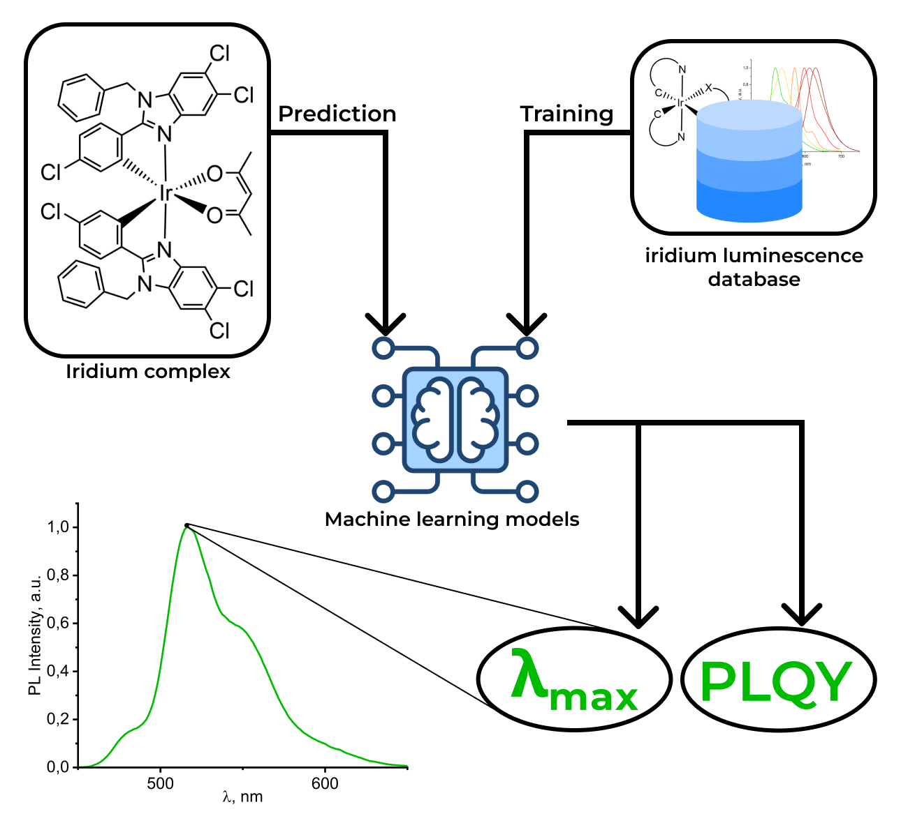

    

The ”IrLumDB App” is an ML-based service integrated with the experimental database to predict luminescence wavelength (λlum) and photoluminescence quantum yield (PLQY) of bis-cyclometalated iridium(III) complexes requiring only molecular formula of the ligands as a feature.

Visit our app <https://irlumdb.streamlit.app/>.

### Notes
To reproduce our research or train your own models see:
- Wavelength.ipynb (λlum prediction)
- PLQY.ipynb (PLQY prediction)
- PLQY_class.ipynb (PLQY class prediction)

## How to cite

Please cite IrLumDB if you use it in your research: .
